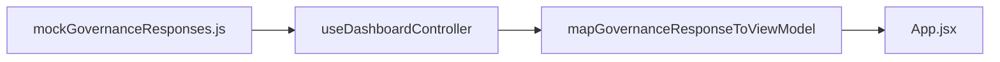

# VECTOR governance console - frontend handoff

## How do I install dependencies and what do I need?

**Node:** 20.19+ or 22.12+ (required by Vite 8).

**Package manager:** npm (`package-lock.json`).

```bash
cd vector-dashboard
npm install
```

**Runtime dependencies:** React 19 and React DOM (see `package.json`).

**Dev dependencies:** Vite 8, `@vitejs/plugin-react`, ESLint 10 with React hooks and refresh plugins.

**Environment:** No `.env` file or `VITE_*` variables are used yet.

> The npm package name in `package.json` is still `noesis-dashboard`; install output may show that label even though the folder is `vector-dashboard`.

## How do I run the frontend locally?

From the `vector-dashboard` directory after `npm install`:

```bash
npm run dev      # http://localhost:5173 (HMR)
npm run build    # production build → dist/
npm run preview  # serve dist/ (default http://localhost:4173)
npm run lint     # ESLint on **/*.{js,jsx}
```

Use a different dev port: `npm run dev -- --port 3000`

**Entry chain:** `index.html` → `src/main.jsx` → `src/App.jsx`

**Styles:** `src/styles/dashboard.css` (imported via `src/index.css`)

## Where does mock / static data live?

| Path | Role |
|------|------|
| `src/data/mockGovernanceResponses.js` | **Primary mock data.** Exports `MOCK_GOVERNANCE_RESPONSES`- an array of three governance payloads (Normal, Conflict, Stop). |
| `src/hooks/useDashboardController.js` | Imports the mock array, maps it through the adapter, and drives scenario index plus the demo auto-cycle timer. |
| `src/adapters/mapGovernanceResponseToViewModel.js` | Maps API-shaped JSON to the UI view model. When the real API is wired, update this file only. |
| `src/model/governanceApi.js` | JSDoc contract for the expected API payload shape (documentation only; no runtime data). |
| `public/favicon.svg`, `public/icons.svg` | Static assets only. |

**Scenario wiring:** Buttons in `RunScenarioCard` call `selectScenario(0)`, `selectScenario(1)`, or `selectScenario(2)` (Normal, Conflict, Stop). **Run demo** auto-cycles `0 → 1 → 2` every 3.4 seconds (`DEMO_STEP_MS` in `useDashboardController.js`).



## Which components render facets, decision, risk, conflicts, and traces?

All regions below are wired in `src/App.jsx` from `viewModel` returned by `useDashboardController`:

| UI region | Component | File |
|-----------|-----------|------|
| **Facets** | `EvaluationFacets` (technical readout via `SlideDisclosure` inside facet cards) | `src/components/EvaluationFacets.jsx`, `src/components/SlideDisclosure.jsx` |
| **Decision** | `DecisionCard` (+ `DecisionIcon`) | `src/components/DecisionCard.jsx`, `src/components/DecisionIcon.jsx` |
| **Risk** | `RiskCard` | `src/components/RiskCard.jsx` |
| **Conflicts** | `ConflictsPanel` | `src/components/ConflictsPanel.jsx` |
| **Traces** | `DecisionTrace` (operational + technical) | `src/components/DecisionTrace.jsx` |

Also on the page: `ScoreCard`, `DashboardHeader` (summary plus alignment/risk/conflict counts), `Sidebar`, and `RunScenarioCard`.

## What are known UI issues or cleanup items?

- **No live API**- There is no `fetch`, Vite proxy, or env-based API URL yet; all data is mock-driven.
- **Unused `SignalMatrix`** - `src/components/SignalMatrix.jsx` exists but is not mounted; `viewModel.signals` is populated but unused in the component tree.
- **Placeholder sidebar** - Single “Dashboard” link with `href="#"`.
- **Responsive layout** - Breakpoints at 900px, 1024px, and 1200px in `dashboard.css`; narrow viewports are not fully verified.
- **Reduced motion** - Some CSS paths respect `prefers-reduced-motion`; not all animations are gated (for example, the score ring via `useAnimatedScore` / `useAnimatedPercent` is only partially covered).
